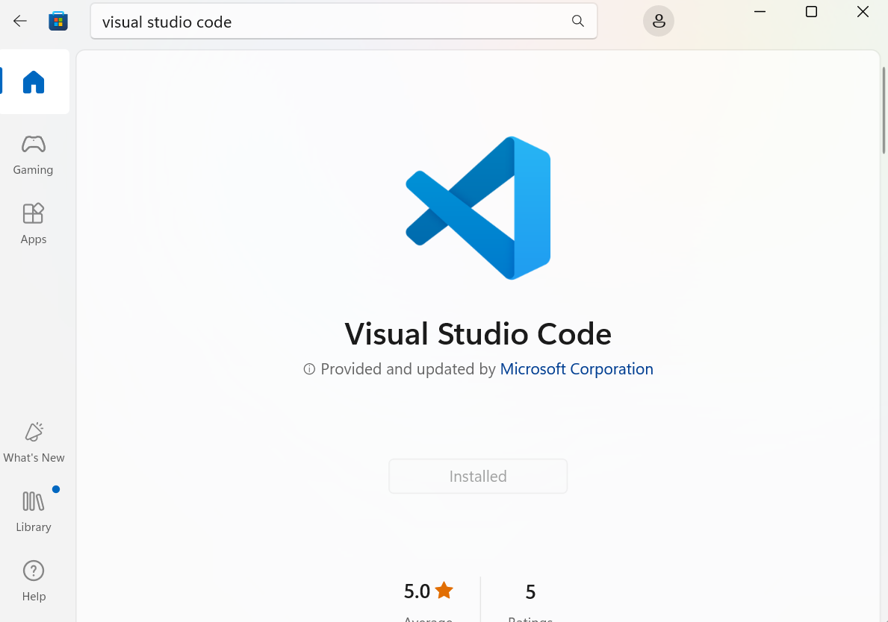

# 1 Installation and Navigation of Visual Studio Code (VS Code)

Visual Studio Code is a source code editor developed by Microsoft for Operating systems like Windows, Linux and macOS. It is useful for debugging, syntax highlighting and embedded version control with Git.

## Installing VS Code
In order to install VS Code, first ensure that you have Administrator privileges and that you have Windows Operating System installed on your local machine.
1.	Navigate to your Microsoft Store and search for Visual studio Code
2.	Select the install button on the Application page to install the application


*Figure 1: VS Code*

3.	After Installing the Application, navigate to your start button and search for VS Code by typing “Visual Studio Code”

### Alternatively you can install VS Code by using the following steps:

1.	Go to the official VS Code website https://code.visualstudio.com/
2.	Select “Download for Windows” to download the installer.
3.	Locate the downloaded .exe file and open it to launch the installer.
4.	Select ‘Yes’ to allow the application to make changes to your device.
5.	Click next to proceed with the installation. Choose the default location and click ‘install’,
6.	Once installed, you can click “Finish” to directly open the VS Code


# 2 First-time Setup:
   - After installing VS Code, what initial configurations and settings should be adjusted for an optimal coding environment? Mention any important settings or extensions.

After installing VS Code, here are some of the steps to follow to configure and set up your coding environment:
### Adjust General Settings
1.	Enable auto saving by adding the following line to the settings.json file:
"files.autoSave": "onWindowChange"
### Installing Extensions
Open your VS Code and navigate to the Extensions Icon and Install the following extensions:
1.	Dart - Dart Code extends VS Code with support for the Dart programming language, and provides tools for effectively editing, refactoring, running, and reloading Flutter mobile apps
2.	Flutter - This VS Code extension adds support for effectively editing, refactoring, running, and reloading Flutter mobile apps
3.	HTML boilerplate - This extension provides the standard HTML boilerplate code used in all web applications.
4.	InteliCode - The Visual Studio IntelliCode extension provides AI-assisted development features for Python, TypeScript/JavaScript and Java developers in Visual Studio Code, with insights based on understanding your code context combined with machine learning.
5.	Markdown - Markdown allows you to write using an easy-to-read, easy-to-write plain text format, then convert it to structurally valid XHTML or HTML
6.	Python - The Python extension makes Visual Studio Code an excellent Python editor, works on any operating system, and is usable with a variety of Python interpreters.
7.	Python Debugger - A Visual Studio Code extension that supports Python debugging with debugpy.
8.	Pylance - An extension that works alongside Python in Visual Studio Code to provide performant language support.
9.	Snowflake - This extension enables you to connect to Snowflake, write and execute sql queries, and view results without leaving VS Code.

# 3 User Interface Overview:
   - Explain the main components of the VS Code user interface. Identify and describe the purpose of the Activity Bar, Side Bar, Editor Group, and Status Bar.

Visual Studio Code has an interface which helps a user and a computer system interact, in particular the use of input devices and software.

## Activity Bar
This vertical bar is located on the side of the VS Code interface:

It gives you access to a number of views and features, including the Run, Debug, Source Control, Explorer, and Search views. Because it makes it easy for users to access and navigate the editor's various capabilities, the Activity Bar is a crucial component of the VS Code interface.

## Side Bar
It is located Adjacent to the activity bar:

There are multiple areas within the Side Bar: the Explorer, Search, Source Control, and Extensions views. While the Search view lets users look for specific text or code snippets within their project, the Explorer view lets users browse and manage the files and folders in their workspace.

## Editor Group
The main area of the VS Code interface, where users may view and modify their code, is called the Editor Group. Users can work on many files at once by using the multiple editor tabs that the Editor Group can have. To better fit their workflow, users can divide the Editor Group into many panes and arrange them either vertically or horizontally. Editor tabs may be included in each window, and users may quickly transition between them by using the mouse or keyboard shortcuts.

## Status Bar
Status bar is a horizontal bar that is found at the bottom of the VS Code interface:

It offers a range of status signals and alerts, including the line and column number that is now displayed, the text format that is chosen, and any problems or warnings that are present in the code. Additionally, the Status Bar has a number of icons that allow you to rapidly access common features like the terminal, debug console, and problem view.


# 4 Command Palette:

It serves as a single location to run commands, browse files, and control different coding environment components. When working with VS Code, you may greatly increase your productivity and efficiency by utilizing the Command Palette.
The Command Palette is an interface element that allows users to perform more efficiently by typing commands. 

## Accessing the Command Palette 
1.	Open Visual Studio Code on your computer
2.	Simultaneously hit the keyboard shortcuts `Ctrl+Shift+P} (Windows, Linux) and `Cmd+Shift+P} (Mac). As an alternative, you can choose "Command Palette" from the dropdown list by clicking on the "View" option at the top.
3.	The Command Palette can be found at the top of the VS Code window as a search bar after it is activated. To limit the selections, you can begin typing your command or query directly into this area.
## Common Tasks Using the Command Palette
### Searching for files
To open any file in your workspace fast, type "Open File" or "Go to File" into the Command Palette and choose it from the list. This capability comes in especially handy when handling numerous files or huge projects.

### Running terminal commands
To execute terminal commands without explicitly opening a terminal window, use the Command Palette. For example, you can create and run tasks straight from the VS Code interface by typing "Terminal: Run Build Task" or "Terminal: New Terminal".

### Managing extensions
Type “Extensions: Manage” into the command Palette search bar to acess various extension related functions like installing, updating or disabling extensions. This feature makes it simple and effective for users to maintain their development environment while keeping up with new features and tools.

### Formatting Code
Type "Format Document" into the Command Palette and choose it from the list of possibilities to format your code in accordance with language standards. This feature helps maintain uniformity between projects and development teams in addition to making code easier to understand.

### Debugging
Type "Debug: Start Debugging" into the Command Palette search bar to start debugging sessions or manage breakpoints. With the help of this functionality, developers may find and fix problems in their code more rapidly without ever leaving the VS Code interface.

### Source control
Enter "Source Control: [Action]" into the Command Palette search bar to access source control features like pushing new commits, fetching updates, or committing changes (e.g., "Source Control: Commit"). With the help of this capability, developers can handle version control straight from their IDE, eliminating the need to transfer between tools or programs.

### Global find
To quickly and effectively perform global search and replace operations across all files in your workspace, type "Find: Find Across Files" into the Command Palette search bar. This functionality helps developers save time by simplifying difficult text manipulation operations.

### Customizing keybindings
In the Command Palette search bar, type "Preferences: Open Keyboard Shortcuts" (or press {Ctrl+K Ctrl+S}) to set custom keybindings for individual commands. This feature increases productivity and overall efficiency when working with VS Code projects by enabling users to customize their IDE experience based on personal preferences and routines.

### Accessing user settings
Enter "Preferences: Open Settings (JSON)" in the Command Palette search bar to change user preferences (or press {Ctrl+{,}). With the help of this tool, users can customize their VS Code environment to suit their own tastes and specific project needs.

### Generating new files/folders
In the Command Palette search field, type "File: New File" or "File: New Folder" to rapidly create new files or folders (you can also press `Ctrl+N} to create a new file). This feature lowers the cost of context switching while establishing new resources during development processes and streamlines project organization activities.

# 5 Extensions in VS Code:
   - Discuss the role of extensions in VS Code. How can users find, install, and manage extensions? Provide examples of essential extensions for web development.

Visual Studio Code (VS Code) extensions are essential for expanding the platform's capabilities and adjusting the development environment to different programming tasks.

## Finding, Installing, and Managing Extensions
### Finding Extensions
1.	VS Code Marketplace: The Visual Studio Code Marketplace is the main resource for extensions. Users can visit the Visual Studio Code Marketplace website or use VS Code's built-in marketplace functionality.
2.	Extension View: Users can access the Extensions view in VS Code by either pressing Ctrl+Shift+X (Windows/Linux) or Cmd+Shift+X (Mac) or by clicking the Extensions icon in the Activity Bar on the side of the window.
3.	Command Palette: By typing "Extensions: Install Extensions" and then looking for the desired extension, users can also install extensions using the Command Palette (Ctrl+Shift+P or Cmd+Shift+P).

### Installing Extensions
1.	Look for Extensions: Users can look for specific extensions by name in the Extensions page, or they can explore categories and suggested extensions.
2.	Install: Once an extension is found, clicking the "Install" button next to the extension will download and install it.
3.	Command Palette: Using the Command Palette (Ctrl+Shift+P or Cmd+Shift+P), users may also install extensions by typing "Extensions: Install Extensions" and then looking for the appropriate extension.

### Managing Extensions 
1.	Enable/Disable: Installed extensions can be enabled or disabled via the Extensions view by clicking on the gear icon next to the extension and selecting "Enable" or "Disable." 
2.	Update: Extensions can be updated when new versions are available. The Extensions view will display an update button if updates are pending. 
3.	Uninstall: Extensions can be uninstalled by clicking the gear icon and selecting "Uninstall." 
4.	Extension Settings: Many extensions have configurable settings that can be accessed by clicking the gear icon and selecting "Extension Settings."

# 6 Integrated Terminal:

## Opening the Integrated Terminal

### Using the Menu to Open the Integrated Terminal
1.	Choose Terminal from the menu bar at the top.
2.	Select "New Terminal" by clicking.
### Utilizing Shortcut Keyboards:
1.	To backtrack on Windows or Linux, press Ctrl + or Ctrl + Shift +.
2.	Press Cmd + (backtick) or Cmd + Shift + on macOS.
### The Command Palette's Use:
1.	To open the Command Palette, press Ctrl + Shift + P (Windows/Linux) or Cmd + Shift + P (macOS).
2.	Type View: Choose the Terminal by toggling it.

## Using the Integrated Terminal
### Change Terminals:
1.	The dropdown menu located in the upper-right corner of the terminal pane can be used to switch between open terminals.
2.	To navigate between the terminals, press Ctrl + Shift + (backtick) on Windows/Linux or Cmd + Shift + (macOS).
### Establish New Terminals:
1.	To open a new terminal, click the + symbol in the terminal window.
2.	To split the terminal pane and have numerous terminal instances side by side, use the command Ctrl + Shift + 5.
### Execute Instructions:
1.	Enter your commands by typing them like you would in any terminal.

## Advantages of Using the Integrated Terminal Compared to an External Terminal
### Practicality:
1.	You can use the integrated terminal without switching between apps because it is incorporated inside VS Code.
2.	With the same interface, you can write code, execute commands, and view the results in a smooth process.
### Awareness of Context:
1.	When the integrated terminal opens, your current project directory is displayed. This lessens the necessity of manually navigating to the root directory of your project.
2.	It has the ability to automatically configure the workspace, including virtual environments for Python projects, based on the setup of the workspace.
### Harmonization:
1.	Changes to the configuration or structure of your project are instantly reflected because the terminal's context is always in sync with it.
2.	For example, executing git operations or build instructions is done with respect to the project root.
### Customization:
1.	You can customize the terminal's appearance and behavior directly from VS Code settings, including the shell type, font, and color theme.
2.	It supports features like split terminal panes, allowing you to run multiple terminal sessions side by side.
### Integrated Tools:
1.	VS Code extensions can interact with the terminal, providing enhanced functionality like debugging, linting, and running tests directly from the editor.
2.	Some extensions can automatically run terminal commands based on file changes or other triggers.
### Quick Access:
1.	Keyboard shortcuts provide quick access to terminal functions without needing to reach for the mouse or switch applications.
### Workspace-Specific Configuration:
1.	Each workspace can have its terminal configuration, allowing for project-specific setups, such as different shell types or environment variables.

# 7 File and Folder Management:
   - Explain how to create, open, and manage files and folders in VS Code. How can users navigate between different files and directories efficiently?
## Create a New File
### From the Explorer:
1.	Open the Explorer by clicking the file icon in the Activity Bar on the side or by pressing Ctrl+Shift+E.
2.	Right-click on any folder or the empty space in the Explorer panel.
3.	Select New File.
4.	Type the name of the new file and press Enter.
### From the Command Palette:
1.	Open the Command Palette with Ctrl+Shift+P.
2.	Type >New File and select the command.
3.	Type the file name and path if you want it in a specific directory.
### Create a New Folder
#### From the Explorer:
1.	Open the Explorer by clicking the file icon in the Activity Bar or by pressing Ctrl+Shift+E.
2.	Right-click on any folder or the empty space in the Explorer panel.
3.	Select New Folder.
4.	Type the name of the new folder and press Enter.
### From the Command Palette:
1.	Open the Command Palette with Ctrl+Shift+P.
2.	Type >New Folder and select the command (ensure the selected folder in Explorer if you want to create it inside a specific directory).
3.	Opening Files and Folders
## Open a File
### From the Explorer:
1.	Simply click on the file in the Explorer pane.
2.	The file will open in a new tab in the editor.
## Using the Command Palette:
1.	Open the Command Palette with Ctrl+Shift+P.
2.	Type >Open File and select the command.
3.	Navigate to the desired file in the file dialog and open it.
## Quick Open:
1.	Press Ctrl+P.
2.	Start typing the name of the file. VS Code will suggest files based on the current project.
3.	Select the file from the list.
## Open a Folder
### From the Menu:
1.	Go to File > Open Folder.
2.	Navigate to the desired folder and open it.
### Using the Command Palette:
1.	Open the Command Palette with Ctrl+Shift+P.
2.	Type >Open Folder and select the command.
3.	Navigate to the desired folder in the file dialog and open it.


## Managing Files and Folders
## Rename a File or Folder
1.	From the Explorer:
o	Right-click on the file or folder.
o	Select Rename.
o	Type the new name and press Enter.
2.	Using the Command Palette:
o	Open the Command Palette with Ctrl+Shift+P.
o	Type >Rename File/Folder and select the command.
o	Enter the new name.
## Move a File or Folder
1.	Drag and Drop:
o	In the Explorer, click and hold the file or folder.
o	Drag it to the desired location.
2.	Using Cut and Paste:
o	Right-click on the file or folder and select Cut.
o	Right-click on the destination folder and select Paste.
## Delete a File or Folder
1.	From the Explorer:
o	Right-click on the file or folder.
o	Select Delete.
o	Confirm the deletion if prompted.
2.	Using the Command Palette:
o	Open the Command Palette with Ctrl+Shift+P.
o	Type >Delete File/Folder and select the command.
o	Confirm the deletion if prompted.
## Navigating Between Files and Directories
### Quick File Navigation
1.	Quick Open:
o	Press Ctrl+P.
o	Start typing the name of the file. VS Code will suggest files based on the current project.
o	Select the file from the list.
2.	Go to File...:
o	Press Ctrl+Shift+P to open the Command Palette.
o	Type >Go to File... and start typing the file name.
###Breadcrumb Navigation
•	Located at the top of the editor, this shows the path of the currently opened file.
•	Click on any part of the path to navigate to that directory or file.
### Split Editor
•	To view multiple files side by side, you can split the editor.
o	Right-click on a file tab and select Split Right or Split Down.
o	You can also drag and drop file tabs to different parts of the editor.
### Navigate Back and Forward
•	Use Alt+Left Arrow to navigate back to the previous file.
•	Use Alt+Right Arrow to navigate forward.
###Peek Definition
•	For code files, you can use Alt+F12 to peek at the definition of a function or variable without leaving your current file.
###Additional Tips
•	Keyboard Shortcuts: Customize or view all available shortcuts through File > Preferences > Keyboard Shortcuts or by pressing Ctrl+K Ctrl+S.
•	Extensions: Install extensions like Path Intellisense or Project Manager to enhance navigation and file management capabilities.
•	Integrated Terminal: Open an integrated terminal with Ctrl+ and use command-line tools for file management directly within VS Code.

# 8 Settings and Preferences:
In Visual Studio Code (VS Code), users can find and customize settings through the Settings UI, JSON configuration files, or Command Palette. Here’s how you can change the theme, font size, and keybindings:

### Accessing Settings

1. **Settings UI**:
   - Click on the gear icon in the lower left corner of the window and select "Settings" from the menu.
   - Alternatively, you can open the Command Palette with `Ctrl+Shift+P` (Windows/Linux) or `Cmd+Shift+P` (Mac) and type "Open Settings (UI)".

2. **Settings JSON**:
   - Open the Command Palette with `Ctrl+Shift+P` (Windows/Linux) or `Cmd+Shift+P` (Mac) and type "Preferences: Open Settings (JSON)".

3. **Command Palette**:
   - Use the Command Palette (`Ctrl+Shift+P` / `Cmd+Shift+P`) to search for specific settings.

### Changing the Theme

1. **Settings UI**:
   - Go to Settings and type "Theme" in the search bar.
   - Click on "Color Theme" and select the desired theme from the list.

2. **Command Palette**:
   - Open the Command Palette (`Ctrl+Shift+P` / `Cmd+Shift+P`) and type "Preferences: Color Theme".
   - Select the desired theme from the list.

### Changing the Font Size

1. **Settings UI**:
   - Go to Settings and type "Font Size" in the search bar.
   - Adjust the `Editor: Font Size` setting to your desired value.

2. **Settings JSON**:
   - Open the Settings JSON file and add or modify the following line:
     ```json
     "editor.fontSize": 14
     ```
     Change `14` to your desired font size.

### Changing Keybindings

1. **Keybindings UI**:
   - Click on the gear icon in the lower left corner of the window and select "Keyboard Shortcuts" from the menu.
   - Alternatively, open the Command Palette and type "Preferences: Open Keyboard Shortcuts".

2. **Keybindings JSON**:
   - Click on the gear icon and select "Keyboard Shortcuts" or open the Command Palette and type "Preferences: Open Keyboard Shortcuts (JSON)".
   - In the JSON file, you can add or modify keybindings. For example:
     ```json
     [
       {
         "key": "ctrl+k ctrl+s",
         "command": "workbench.action.files.save"
       }
     ]
     ```
     This example sets `Ctrl+K Ctrl+S` to save the current file.

### Example Changes

1. **Change Theme to Dark+ (default dark)**:
   - Open the Command Palette (`Ctrl+Shift+P` / `Cmd+Shift+P`), type "Preferences: Color Theme", and select "Dark+ (default dark)".

2. **Set Font Size to 16**:
   - In the Settings UI, search for "Font Size" and set `Editor: Font Size` to 16.
   - In the Settings JSON:
     ```json
     "editor.fontSize": 16
     ```

3. **Change Keybinding for Save to Ctrl+S**:
   - Open the Keybindings UI and search for the "Save" command.
   - Click on the pencil icon next to it and press `Ctrl+S`.
   - Alternatively, in the Keybindings JSON:
     ```json
     [
       {
         "key": "ctrl+s",
         "command": "workbench.action.files.save"
       }
     ]
     ```

These methods provide flexibility for users to customize VS Code according to their preferences, enhancing their coding experience.

# 9 Debugging in VS Code:
To set up and start debugging a simple program in Visual Studio Code (VS Code), follow these steps:

### Setting Up Debugging in VS Code

1. **Install VS Code**:
   - Download and install VS Code from the official website [here](https://code.visualstudio.com/).

2. **Install the Required Extensions**:
   - For most programming languages, you'll need to install the relevant extension. For example, for Python, install the "Python" extension by Microsoft from the Extensions view (`Ctrl+Shift+X`).

3. **Open Your Project**:
   - Open VS Code and use `File > Open Folder` to open the folder containing your project files.

4. **Configure the Debugger**:
   - Open the Debug view by clicking the Debug icon in the Activity Bar on the side of the VS Code window or using the shortcut `Ctrl+Shift+D`.
   - Click on the gear icon to open the `launch.json` configuration file.
   - If you don't have a `launch.json` file yet, VS Code will prompt you to select a debugger configuration. Select the appropriate configuration for your project.

   Here is an example of a basic `launch.json` configuration for a Python script:

   ```json
   {
       "version": "0.2.0",
       "configurations": [
           {
               "name": "Python: Current File",
               "type": "python",
               "request": "launch",
               "program": "${file}",
               "console": "integratedTerminal"
           }
       ]
   }
   ```

5. **Set Breakpoints**:
   - Open the file you want to debug.
   - Click on the left margin next to the line number where you want to set a breakpoint. A red dot will appear indicating the breakpoint.

6. **Start Debugging**:
   - In the Debug view, select your configuration from the drop-down menu and click the green play button or press `F5` to start debugging.

### Key Debugging Features in VS Code

1. **Breakpoints**:
   - Set breakpoints to pause the execution of your program at specific lines of code.

2. **Step Through Code**:
   - Step Over (`F10`): Execute the current line of code and move to the next line.
   - Step Into (`F11`): Step into functions to debug inside them.
   - Step Out (`Shift+F11`): Step out of the current function and return to the calling function.

3. **Variable Inspection**:
   - Hover over variables to see their current values.
   - Use the Variables pane in the Debug view to inspect the state of all variables in the current scope.

4. **Watch Expressions**:
   - Add expressions to the Watch pane to monitor their values as you step through the code.

5. **Call Stack**:
   - View the call stack to see the sequence of function calls that led to the current point in execution.

6. **Debug Console**:
   - Use the Debug Console to execute commands and evaluate expressions in the context of the debugged program.

7. **Conditional Breakpoints**:
   - Right-click on a breakpoint to set conditions for when it should be triggered.

8. **Logpoints**:
   - Instead of pausing execution, use logpoints to print messages to the console without stopping the program.

By following these steps, you can effectively set up and start debugging your programs in VS Code, leveraging its powerful debugging features to streamline your development process.

# 10 Using Source Control:
  Integrating Git with VS Code for version control is straightforward and enhances your development workflow by providing a seamless environment for code management. Here's a step-by-step guide to initializing a repository, making commits, and pushing changes to GitHub.

### Integrating Git with VS Code

1. **Install VS Code**:
   - Ensure you have VS Code installed from the official website [here](https://code.visualstudio.com/).

2. **Install Git**:
   - Download and install Git from [here](https://git-scm.com/).

3. **Open Your Project in VS Code**:
   - Launch VS Code and open the folder containing your project by navigating to `File > Open Folder`.

### Initializing a Repository

1. **Initialize Git Repository**:
   - Open the Source Control view by clicking the Source Control icon in the Activity Bar on the side of the VS Code window or using the shortcut `Ctrl+Shift+G`.
   - Click the "Initialize Repository" button or run the command `Git: Initialize Repository` from the Command Palette (`Ctrl+Shift+P`).
   - This will create a `.git` directory in your project folder, initializing a new Git repository.

### Making Commits

1. **Track Changes**:
   - VS Code will show changes in your files in the Source Control view.
   - Files that are modified, added, or deleted will appear under the "Changes" section.

2. **Stage Changes**:
   - To stage changes, click the `+` icon next to the files you want to include in the commit.
   - Alternatively, you can stage all changes by clicking the `+` icon next to the "Changes" heading.

3. **Commit Changes**:
   - Once you have staged your changes, enter a commit message in the input box at the top of the Source Control view.
   - Click the checkmark icon or press `Ctrl+Enter` to commit the changes.

### Pushing Changes to GitHub

1. **Create a Repository on GitHub**:
   - Go to [GitHub](https://github.com/) and log in to your account.
   - Click the `+` icon in the top right corner and select "New repository".
   - Fill in the repository details and click "Create repository".

2. **Add Remote Repository**:
   - Copy the repository URL from GitHub.
   - In VS Code, open the terminal (`Ctrl+` ` ` or `View > Terminal`).
   - Add the remote repository by running the following command in the terminal:
     ```sh
     git remote add origin https://github.com/your-username/your-repository.git
     ```

3. **Push Changes**:
   - To push your local commits to GitHub, run the following command in the terminal:
     ```sh
     git push -u origin master
     ```
   - You can also use the push button in the Source Control view.

### Summary of Commands

- **Initialize Repository**: `Git: Initialize Repository` or `git init`
- **Stage Changes**: `+` icon in Source Control or `git add <file>`
- **Commit Changes**: `Ctrl+Enter` in Source Control or `git commit -m "Your commit message"`
- **Add Remote**: `git remote add origin https://github.com/your-username/your-repository.git`
- **Push Changes**: `git push -u origin master`

### Additional Tips

- **Branching**: You can manage branches directly from the Source Control view or the terminal using commands like `git branch`, `git checkout`, and `git merge`.
- **Pulling Changes**: Use the pull button in the Source Control view or run `git pull` in the terminal to fetch and merge changes from the remote repository.
- **Syncing Changes**: The "Sync Changes" button in the Source Control view can be used to perform both `git pull` and `git push` in one step.

By following these steps, you can efficiently manage your code using Git and GitHub within VS Code, leveraging the powerful version control features integrated into the editor.

# References
1.	AskAI, private communication, June 2024
2.	ChatGPT, private communication, June 2024
3.	A. D. Sole,  "Visual Studio Code Distilled", Cremona, Italy, 2018
4.	S. Chacon, B. Straub, “Pro Git”, 2009

